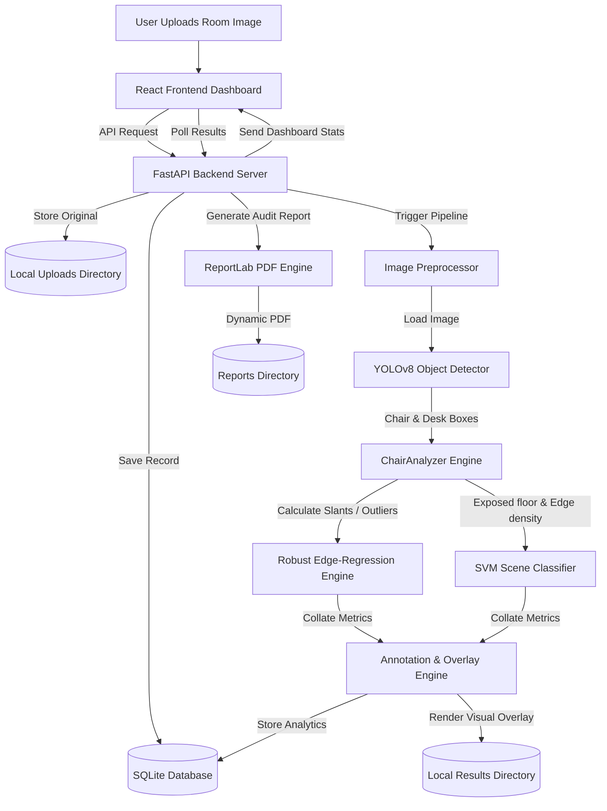

# AI-Powered Smart Lab Chair Monitoring System 🪑🔍

An advanced computer vision and machine learning-powered system designed to automate classroom and computer laboratory audits. It automatically detects chairs and desks, evaluates alignment quality, identifies misplaced or pulled-out chairs blocking aisles, and generates professional PDF reports and visual overlays through an interactive dashboard.

---

## 🚀 Tech Stack

The system is split into a robust Python-based AI backend and a modern React-based frontend dashboard.

### **AI Backend (Python)**
*   **Web Framework**: [FastAPI](https://fastapi.tiangolo.com/) (Asynchronous, high-performance, and automatic API documentation)
*   **Object Detection**: [YOLOv8](https://github.com/ultralytics/ultralytics) (via `ultralytics` local PyTorch framework) using the lightweight `yolov8n.pt` weights.
*   **Scientific Computing & Image Processing**: 
    *   [OpenCV](https://opencv.org/) (Image preprocessing, HSV color spaces, contour analysis, text overlays)
    *   [NumPy](https://numpy.org/) (Fast matrix computations, polyfit regression calculations, and spatial vector mathematics)
    *   [scikit-learn](https://scikit-learn.org/) (SVM scene classification)
*   **Database**: [SQLite](https://sqlite.org/) with [aiosqlite](https://github.com/omnilib/aiosqlite) (Asynchronous, self-contained SQL database engine)
*   **Reporting**: [ReportLab](https://www.reportlab.com/) (Dynamic, professional PDF generation with status summaries and visual assets)
*   **Server**: [Uvicorn](https://www.uvicorn.org/) (ASGI server)

### **Frontend Dashboard (Vite + React)**
*   **Build Tool**: [Vite](https://vite.dev/) (Ultra-fast local development & build system)
*   **Core UI**: [React 19](https://react.dev/)
*   **Data Visualization**: [Recharts](https://recharts.org/) (Responsive charts for daily analysis trends and accuracy analytics)
*   **Icons**: [Lucide React](https://lucide.dev/) (Modern and beautiful vector icons)
*   **Styling**: Vanilla CSS (Tailored glassmorphic grids, premium gradients, and interactive states)

---

## 🏗️ System Architecture & Workflow



### **1. AI Detection & Alignment Pipeline**
*   **YOLOv8 Detection**: The system reads the classroom image and runs a local YOLOv8 inference to detect `chair` (Class ID 56) and `dining table` (Class ID 60, acting as desks).
*   **Robust Edge-Anchored Regression**:
    *   Chairs are automatically clustered into layout columns (e.g., left and right aisles) based on their horizontal (`x`) distribution.
    *   Instead of simple averages, the system applies **robust polyfit regression** to tucked-in "anchor" chairs to model the natural slant and perspective of laboratory aisles.
    *   Chairs that drift significantly into the aisle relative to the regression line (outliers) are mathematically flagged as **"Pulled out"**.
*   **Custom SVM Scene Classification**:
    *   The model extracts 14 visual features: floor exposure (HSV floor masking), edge density (Canny filtering), aspect ratio variances, spacing standard deviations, and horizontal variances.
    *   An SVM (Support Vector Machine) classifier (`scene_classifier.pkl`) evaluates these features to score the overall room layout quality and assign a global arrangement classification (`correct_arrangement` vs. `misplaced_arrangement`).

---

## 📁 Repository Structure

```
Labproject/
├── backend/
│   ├── app.py                      # FastAPI Web Application & API Entrypoint
│   ├── requirements.txt            # Python Backend Dependencies
│   ├── yolov8n.pt                  # YOLOv8 Object Detection Weights
│   ├── test_data.json              # Sample test configurations
│   ├── data/
│   │   └── chair_monitor.db        # Automatically initialized SQLite database
│   ├── models/
│   │   ├── analyzer.py             # ChairAnalyzer core engine (Regression + SVM)
│   │   ├── scene_classifier.pkl    # Serialized SVM Classifier Model
│   │   └── trained_profile.json    # Feature mapping & normalization configurations
│   ├── services/
│   │   ├── database.py             # Asynchronous database helper functions
│   │   ├── image_processor.py      # Image format validation & resizing helpers
│   │   └── report_generator.py     # PDF report compiler using ReportLab
│   ├── uploads/                    # Stores uploaded source files (gitignored)
│   ├── results/                    # Stores annotated results & overlays (gitignored)
│   └── reports/                    # Stores compiled PDF reports (gitignored)
│
├── frontend/
│   ├── index.html                  # Main entry document
│   ├── package.json                # Node package config & scripts
│   ├── vite.config.js              # Vite server & build configurations
│   ├── src/
│   │   ├── main.jsx                # React App Renderer
│   │   ├── App.jsx                 # Core routing, view swapping, and layout
│   │   ├── index.css               # Global glassmorphic & dark-mode styling tokens
│   │   └── components/
│   │       ├── DashboardView.jsx   # Metrics, Daily graphs, and room tables
│   │       ├── UploadView.jsx      # File upload interface and interactive analysis view
│   │       ├── HistoryView.jsx     # Filtering list, audit records, and report downloads
│   │       └── Toast.jsx           # Notification overlay alert component
│
└── .env                            # Backend configuration settings
```

---

## ⚙️ How to Setup and Run

Ensure you have **Python 3.8+** and **Node.js 16+** installed on your system.

### **1. Configure Environment Variables**
Create a `.env` file in the project root (`Labproject/.env`):
```env
PORT=8000
HOST=0.0.0.0
# Add any optional parameters here
```

---

### **2. Setup and Start the AI Backend**

1.  **Open your terminal and navigate to the project root**:
    ```bash
    cd Labproject
    ```
2.  **Create and activate a virtual environment (Recommended)**:
    *   **Windows**:
        ```bash
        python -m venv .venv
        .venv\Scripts\activate
        ```
    *   **macOS/Linux**:
        ```bash
        python3 -m venv .venv
        source .venv/bin/activate
        ```
3.  **Install the Python dependencies**:
    ```bash
    pip install -r backend/requirements.txt
    ```
4.  **Run the backend server**:
    Run the application as a module from the root directory so Python correctly resolves local relative package paths:
    ```bash
    python -m backend.app
    ```
    *The FastAPI backend will spin up and start listening at **`http://localhost:8000`**.*
    *Database structures (`data/chair_monitor.db`) and utility folders will be created automatically on the first startup.*

---

### **3. Setup and Start the React Frontend Dashboard**

1.  **Open a new terminal window and navigate to the frontend directory**:
    ```bash
    cd Labproject/frontend
    ```
2.  **Install node dependencies**:
    ```bash
    npm install
    ```
3.  **Run in Development Mode**:
    ```bash
    npm run dev
    ```
    *The local hot-reloading development server will boot at **`http://localhost:5173`**.*
    *All requests to `/api` are automatically proxied to your backend on port 8000 via the Vite server configuration.*

4.  **Build for Production (Optional)**:
    If you want the FastAPI server to serve the frontend statically (at port 8000), compile a static bundle:
    ```bash
    npm run build
    ```
    *The static output is placed in `frontend/dist`. The backend automatically detects this path and mounts it to the root URL `/`.*

---

## 📊 Features Demo & Testing

You can use the built-in debug files and scripts to experiment with the detection accuracy and alignment heuristics:
*   `tools/validate_detector.py` runs validation tests on raw chairs.
*   The upload view allows dragging and dropping any classroom JPEG/PNG image. Once analyzed, you will see a side-by-side view highlighting layout accuracy, general AI description, and any flagged chairs.
